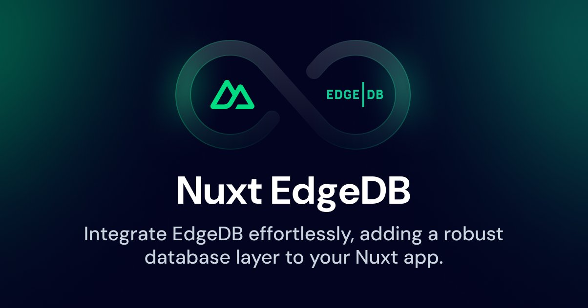

# Nuxt EdgeDB

[![npm version][npm-version-src]][npm-version-href]
[![npm downloads][npm-downloads-src]][npm-downloads-href]
[![License][license-src]][license-href]
[![Nuxt][nuxt-src]][nuxt-href]

Integrate [Nuxt 3](https://nuxt.com) with [EdgeDB](https://www.edgedb.com) effortlessly, adding a robust database layer to your app with minimal configuration.

## Features

- 🍱 **Effortless Integration**: Set up a database with just one line of configuration.
- 🎩 **Live Schema Updates**: Experience _HMR-like DX_ with watchers on **schema**, **queries**, and **migrations**.
- 🛟 **Typed Query Generation**: Automatically generate a typed query client with [@edgedb/generate](https://www.edgedb.com/docs/clients/js/generation).
- 🍩 **Integrated Database Management**: Pilot your database from [Nuxt DevTools](https://github.com/nuxt/devtools).
- 🔐 **Flexible Auth**: 1-line toggle [Email](https://www.edgedb.com/docs/guides/auth/email_password) or [OAuth](https://www.edgedb.com/docs/guides/auth/oauth) authentication, with support for custom auth providers.
- 🧙 **Initial guidance**: Guides you through [EdgeDB CLI](https://www.edgedb.com/docs/cli/index) setup and [project initialization](https://www.edgedb.com/docs/cli/edgedb_project/edgedb_project_init).

## Quick Setup

1. Add `nuxt-edgedb-module` dependency to your project

```bash
npx nuxi@latest module add edgedb
```

2. Add `nuxt-edgedb-module` to the `modules` section of `nuxt.config.ts`

```js
export default defineNuxtConfig({
  modules: [
    'nuxt-edgedb-module'
  ]
})
```

3. Run `npx nuxt-edgedb-module` in your project root to run the CLI setup wizard.

```bash
npx nuxt-edgedb-module
```

That's it! Your Nuxt project now have a database. ✨

If you do not already have [EdgeDB](https://www.edgedb.com) installed on your machine, the install wizard will help you install it.

## Example project

If you want to run the example project, you have to clone this repository and run the playground.

As EdgeDB cannot run on web containers environment like Stackblitz or CodeSandbox.

```bash
git clone git@github.com:Tahul/nuxt-edgedb.git
cd nuxt-edgedb
pnpm install
pnpm stub
cd playground
edgedb project init
npx nuxt-edgedb-module
pnpm run dev
```

## Module options

You can configure any behavior from the module from your `nuxt.config.ts` file:

```typescript
export default defineNuxtConfig({
  modules: ['nuxt-edgedb-module'],
  edgeDb: {
    // Devtools integrations
    devtools: true,
    // Completely toggle watchers feature
    watch: true,
    // Enable or disable prompts on watch events
    watchPrompt: true,
    // Generate target for your queries and query builder
    generateTarget: 'ts',
    // dbschema/ dir
    dbschemaDir: 'dbschema',
    // Individual queries dir (useEdgeDbQueries composable)
    queriesDir: 'queries',
    // Toggle CLI install wizard
    installCli: true,
    // Toggles composables
    composables: true,
    // Toggles auto-injection on auth credentials
    injectDbCredentials: true,
    // Enables authentication integration
    auth: false,
    // Enables oauth integration
    oauth: false,
  }
})
```

## Server usage

The module auto-imports all composables available in the `server/` context of your Nuxt app.

### useEdgeDb

`useEdgeDb` exposes the raw client from the `edgedb` import using your Nuxt environment configuration.

```typescript
// server/api/blogpost/[id].ts
import { defineEventHandler, getRouterParams } from 'h3'

export default defineEventHandler(async (req) => {
  const params = getRouterParams(req)
  const id = params.id
  const client = useEdgeDb()

  const blogpost = await client.querySingle(`
    select BlogPost {
      title,
      description
    } filter .id = <uuid>$id
  `, {
    id: id
  });

  return blogpost
})
```

### useEdgeDbQueries

`useEdgeDbQueries` exposes all your queries from `dbschema/queries.ts`.

You do not have to pass them a client. They will use the one generated by `useEdgeDb` that is scoped to the current request.

```esdl
// queries/getBlogPost.edgeql
select BlogPost {
  title,
  description
} filter .id = <uuid>$blogpost_id
```

```typescript
// server/api/blogpost/[id].ts
import { defineEventHandler, getRouterParams } from 'h3'

export default defineEventHandler(async (req) => {
  const params = getRouterParams(req)
  const id = params.id
  const { getBlogpPost } = useEdgeDbQueries()
  const blogPost = await getBlogpost({ blogpost_id: id })

  return blogpost
})
```

You can still import [queries](https://www.edgedb.com/docs/clients/js/queries) directly from `#edgedb/queries` and pass them the client from `useEdgeDb()`.

```typescript
// server/api/blogpost/[id].ts
import { getBlogPost } from '#edgedb/queries'
import { defineEventHandler, getRouterParams } from 'h3'

export default defineEventHandler(async (req) => {
  const params = getRouterParams(req)
  const id = params.id
  const client = useEdgeDb()
  const blogPost = await getBlogpost(client, { blogpost_id: id })

  return blogpost
})
```

### useEdgeDbQueryBuilder

`useEdgeDbQueryBuilder` exposes the generated [query builder](https://www.edgedb.com/docs/clients/js/querybuilder) directly to your `server/` context.

```typescript
// server/api/blogpost/[id].ts
import { defineEventHandler, getRouterParams } from 'h3'

export default defineEventHandler(async (req) => {
  const params = getRouterParams(req)
  const id = params.id
  const client = useEdgeDb()
  const e = useEdgeDbQueryBuilder()

  const blogPostQuery = e.select(
    e.BlogPost,
    (blogPost) => ({
      id: true,
      title: true,
      description: true,
      filter_single: { id }
    })
  )

  const blogPost = await blogPostQuery.run(client)

  return blogpost
})
```

### Typings

All the interfaces generated by EdgeDB are available through imports via `#edgedb/interfaces`.

```vue
<script setup lang="ts">
import type { BlogPost } from '#edgedb/interfaces'

defineProps<{ blogPost: BlogPost }>()
</script>
```

## Authentification

You can use EdgeDB as a server-only database exposed via `server/api` endpoints and `$fetch` on the client, avoiding the need for authentication.

But in some projects, you might want your users to login so they have an identity on the server as well. Luckily, the module got you covered.

> Before going through these auth installation steps, we strongly recommend you to read the [EdgeDB Auth](https://www.edgedb.com/docs/guides/auth/index#auth) documentation.

### Enable the `auth` option in your Nuxt configuration

```ts
export default defineNuxtConfig({
  modules: ['nuxt-edgedb-module'],
  edgedb: {
    auth: true
  }
})
```

### Setup EdgeDB Auth in your schema

In this example, you can notice:

- `global current_user` which defines a [global property](https://www.edgedb.com/docs/datamodel/globals) linked to the client token identity.
- `type User` is the model if your user, you are free to change it, that can be done later on thanks to migrations.
- `access policy author_has_full_access` & `using (.author ?= global current_user);` defines the policy for the users to only have access to their own `BlogPost`.

```esdl
// dbschema/default.esdl
using extension auth;

module default {
  global current_user := (
    assert_single((
      select User { id, name }
      filter .identity = global ext::auth::ClientTokenIdentity
    ))
  );

  type User {
    required name: str;
    required identity: ext::auth::Identity;
  }

  type BlogPost {
    property content: str {
      default := 'My blog post content.';
    };
    property title: str {
      default := 'My blog post';
    };
    required author: User;

    access policy author_has_full_access
      allow all
      using (.author ?= global current_user);

    access policy others_read_only
      allow select;
  }
}
```

You can edit this schema while your server is running and accept the prompted messages to auto-migrate.

If you are doing these edits while the server is off, you can run `edgedb migration create` and `edgedb migrate`.

### Setup EdgeDB auth in your server

You will need to enable auth providers on your EdgeDB server.

That can be done in the `EdgeDB` tab through your DevTools.

Browse your database to `Auth Admin` and specify:

- `auth_signing_key`
- `allowed_redirect_urls`

You must also enable some providers. You can start with `Email + Password` for instance.

If you enable `required_verification`, you will need to configure a SMTP server for you EdgeDB instance.

You can find further instructions on how to use [Mailtrap](https://mailpit.axllent.org/docs/configuration/) locally to try this feature [here](https://www.edgedb.com/docs/guides/auth/index#email-and-password).

> Do not forget these steps must also be performed on your production environment.

### Use authentication components on the client

As you enabled auth in your config, the module injected these components in your project:

- [`EdgeDbAuthEmailLogin`](./src/runtime/components/EdgeDbAuthEmailLogin.vue)
- [`EdgeDbAuthEmailVerify`](./src/runtime/components/EdgeDbAuthEmailVerify.vue)
- [`EdgeDbAuthLogout`](./src/runtime/components/EdgeDbAuthLogout.vue)
- [`EdgeDbAuthResetPassword`](./src/runtime/components/EdgeDbAuthResetPassword.vue)
- [`EdgeDbAuthSendPasswordReset`](./src/runtime/components/EdgeDbAuthSendPasswordReset.vue)
- [`EdgeDbAuthSignup`](./src/runtime/components/EdgeDbAuthSignup.vue)
- [`EdgeDbAuthProviders`](./src/runtime/components/EdgeDbAuthProviders.vue)

You can look at the sources of these components to learn more about their props.

They all are unstyled components that only expose the necessary logic to achieve a smooth authentication flow.

```vue
<template>
  <EdgeDbAuthEmailLogin
    v-slot="{ email, updateEmail, password, updatePassword, submit, loading }"
    redirect-to="/"
  >
    <div>
      <input
        type="email"
        :value="email"
        placeholder="your@email.com"
        @change="(e) => updateEmail(e.target.value)"
      >
      <input
        type="password"
        :value="password"
        placeholder="password"
        @change="(e) => updatePassword(e.target.value)"
      >
      <button
        type="button"
        @click="(e) => !loading && submit()"
      >
        {{ loading ? 'Loading' : 'Login' }}
      </button>
    </div>
  </EdgeDbAuthEmailLogin>
</template>
```

Of course, you can totally rewrite any of these components locally to implement your own authentication flow.

### OAuth

If you want to use OAuth, you will have to enable it in your `nuxt.config`:

```typescript
export default defineNuxtConfig({
  edgeDb: {
    oauth: true
  }
})
```

That will inject two new components to your app:

- [`EdgeDbOAuthButton`](./src/runtime/components/EdgeDbOAuthButton.vue)
- [`EdgeDbOAuthCallback`](./src/runtime/components/EdgeDbOAuthCallback.vue)

EdgeDB currently supports [OAuth](https://www.edgedb.com/docs/guides/auth/oauth#oauth) for the following providers:

- Apple
- Azure (Microsoft)
- GitHub
- Google

In order to get OAuth working, you will have to visit your EdgeDB Instance UI, via the Nuxt DevTools.

Browse to your database and visit the "Auth Admin" tab.

In your list of providers, you can then add any provider you want and configure the necessary keys (usually client `appid` and `secret`).

> Do not forget to set the callback url of your provider to the one listed at the top of your EdgeDB Auth Admin.

Then, you can then create a simple OAuth button in your app like this:

```vue
<template>
  <!-- Gives access to all available auth providers -->
  <EdgeDbAuthProviders v-slot="{ oAuthProviders: providers }">
    <!-- Create a OAuth button behavior from a provider name -->
    <EdgeDbOAuthButton
      v-for="provider of providers"
      :key="provider.name"
      v-slot="{ redirect }"
      :provider="provider.name"
    >
      <!-- Call `redirect` from the OAuthButton -->
      <button @click="() => redirect()">
        {{ provider.display_name }}
      </button>
    </EdgeDbOAuthButton>
  </EdgeDbAuthProviders>
</template>
```

You will also need a call back page, that can use `EdgeDbAuthCallback`.

```vue
<template>
  <EdgeDbOAuthCallback
    v-slot="{ loading }"
    redirect-to="/"
  >
    <div>
      <h2>OAuth callback</h2>
      <p v-if="loading">
        Loading...
      </p>
      </UCard>
    </div>
  </EdgeDbOAuthCallback>
</template>
```

Amazing right?! In just a few lines, we just added a basic authentication to our application.

### Client-side usage

Now that the authentication is implemented, you also have access to the `useEdgeDbIdentity` composable in your Nuxt app.

```vue
<script setup lang="ts">
const { isLoggedIn } = useEdgeDbIdentity()
</script>

<template>
  <div>
    <LoginButton v-if="isLoggedIn" />
    <LogoutButton v-else />
  </div>
</template>
```

You can look at the [`useEdgeDbIdentity`](./src/runtime/composables/useEdgeDbIdentity.ts) for more details.

### Server-side usage

The authentication process does use a cookie called `edgedb-auth-token`.

On the server, if you want to authenticate your requests to the database for the current user, you only have to pass the current request object to composables:

```typescript
export default defineEventHandler(async (req) => {
  // Will throw an error, as you cannot delete a BlogPost without being the author
  const { deleteBlogPost } = useEdgeDbQueries()
  await deleteBlogPost({ blogpost_id: id })

  // Success
  const { deleteBlogPost: deleteBlogPostAuthenticated } = useEdgeDbQueries(req)
  await deleteBlogPostAuthenticated({ blogpost_id: id })

  return { id }
})
```

### Other authentication solutions

EdgeDDB Auth is a great solution, but eventually your app may require more features later.

Do not forget that EdgeDB can also be used as a database. You can build your own auth or use existing solutions like:

- [Sidebase Nuxt Auth](https://github.com/sidebase/nuxt-auth)
- [Nuxt Auth (when ready)](https://github.com/nuxt-community/auth-module)
- [Nuxt Auth Utils](https://github.com/Atinux/nuxt-auth-utils#supported-oauth-providers)
- Your own implementation

You can also use _both_ and create Identity objects from your own authentication provider, and use `edgedb-auth-token` as your cookie.

I would recommend looking at [https://github.com/edgedb/edgedb-examples] that is filled with great examples of custom authentications built on EdgeDB.

### Authentication environment variables

```sh
# Your EdgeDB instance auth extension base URL
NUXT_EDGEDB_AUTH_BASE_URL=http://localhost:10702/db/edgedb/ext/auth/
# Your EdgeDB instance OAuth callback URL
NUXT_EDGEDB_OAUTH_CALLBACK=http://localhost:10702/db/edgedb/ext/auth/callback
# Your app callback page
NUXT_EDGEDB_OAUTH_REDIRECT_URL=http://localhost:3000/auth/callback
# Your app app reset password URL (receiving the token from the forgot password email)
NUXT_EDGEDB_AUTH_RESET_PASSWORD_URL=http://localhost:3000/auth/reset-password
# Your app email verify url (receiving the token from email verify feature)
NUXT_EDGEDB_AUTH_VERIFY_REDIRECT_URL=http://localhost:3000/auth/verify
```

### Going further with authentication

EdgeDB Auth only provides the bare minimal identity feature for authentication.

In the code example provided for authentication setup, a `User` type goes along with the `Identity` interface.

If you want to fill `User` with other attributes upon registration, you will have to implement this behavior yourself.

If you want to resolve data from OAuth providers, you can use the Nitro hook called `edgedb:auth:callback` from a Nitro plugin.

```
// server/plugins/auth.ts

export default defineNitroPlugin((app) => {
  app.hooks.hook('edgedb:auth:callback', (data) => {
    const {
      code,
      verifier,
      codeExchangeUrl,
      codeExchangeResponseData,
    } = data

    // codeExchangeResponseData contains the OAuth token from the provider.
    // ... implement your own authentication logic.
  })
})
```

## Production

If you want to get out of development and deploy your database to prodution, you must follow the [EdgeDB guides](https://www.edgedb.com/docs/guides/deployment/index).

[EdgeDB](https://www.edgedb.com) is an open-source database that is designed to be self-hosted.

However, they also offer a [Cloud](https://www.edgedb.com/docs/guides/cloud), which is fully compatible with this module thanks to environment variables.

If you want to customize the [DSN] used by the composables, you can use the environment variables provided by the module:

```
NUXT_EDGEDB_HOST=
NUXT_EDGEDB_PORT=
NUXT_EDGEDB_USER=
NUXT_EDGEDB_PASS=
NUXT_EDGEDB_DATABASE=
```

> If you want to use the env variables, you have to specify **ALL** of them, otherwise the client will fallback on default values.

## Q&A

### Will my database client be exposed in userland?

No, `useEdgeDb` and `useEdgeDbQueries` are only available in the [server/](https://nuxt.com/docs/guide/directory-structure/server) context of Nuxt.

You can, as an **opt-in** feature, import queries from `@dbschema/queries` on the client.

You will need to provide these queries with a client from `createClient()`.

```vue
<script setup lang="ts">
import { createClient } from 'edgedb'
import { getUser } from '@dbschema/queries'

const client = createClient()
const user = await getUser(client, 42)
</script>
```

You can also, still as an **opt-in** feature, import the query builder to the client.

I guess that can be useful for a super-admin/internal dashboard, but use it at your own risks in terms of security access.

```vue
<script setup lang="ts">
import e, { type $infer } from '#edgedb/builder'

const query = e.select(e.Movie, () => ({ id: true, title: true }))
type result = $infer<typeof query>
//   ^ { id: string; title: string }[]
</script>
```

Be careful with these imports, as if you import wrong queries, you might end up with write operations available to the client, potentially damaging your database.

### How do I run my migrations in production?

- Clone your Nuxt project on your production environment
- Ensure you have [EdgeDB CLI](https://www.edgedb.com/docs/cli/index) installed on the server
- Add `edgedb migrate --quiet` to your CLI script

### Should I version generated files?

No, as they are generated with your Nuxt client, you should add them to your `.gitignore`

```.gitignore
**/*.edgeql.ts
dbschema/queries.*
dbschema/query-builder
dbschema/interfaces.ts
queries/*.query.ts
```

You must change these paths accordingly if you change the `**Dir` options.

### Is HMR for my database schema really safe?

Well, it depends on when you want to use it.

I would suggest keeping `watchPrompt` enabled while you casually dev on your project.

That will prevent from running any unwanted migration, and will only prompt when you add new things to your schemas.

If you want to go fast and know what you are doing, you can set `watchPrompt` to false, and profit from automatic migration creation and applying on any change on your schemas.

If you do not want any of these features, just set `watch` to false and feel safe about changes applied to your development database.

> HMR on your database obviously has **NO** effect in production context.

### Why the name isn't `nuxt-edgedb`

Because that handle is already taken on NPM.

It seem to be taken by [`ohmree`](https://github.com/ohmree), but the package seem inactive.

If anyone happens to know him, I would be happy to get in touch with him!

### Contributions

There is still plenty of great features to build for this integration.

I would be happy to receive and review any Pull Request.

## Development

```bash
# Install dependencies
npm install

# Generate type stubs
npm run dev:prepare

# Develop with the playground
npm run dev

# Build the playground
npm run dev:build

# Run ESLint
npm run lint

# Run Vitest
npm run test
npm run test:watch

# Release new version
npm run release
```

## Sponsors

[](https://thecompaniesapi.com)

<!-- Badges -->
[npm-version-src]: https://img.shields.io/npm/v/nuxt-edgedb-module/latest.svg?style=flat&colorA=18181B&colorB=28CF8D
[npm-version-href]: https://npmjs.com/package/nuxt-edgedb-module

[npm-downloads-src]: https://img.shields.io/npm/dm/nuxt-edgedb-module.svg?style=flat&colorA=18181B&colorB=28CF8D
[npm-downloads-href]: https://npmjs.com/package/nuxt-edgedb-module

[license-src]: https://img.shields.io/npm/l/nuxt-edgedb-module.svg?style=flat&colorA=18181B&colorB=28CF8D
[license-href]: https://npmjs.com/package/nuxt-edgedb-module

[nuxt-src]: https://img.shields.io/badge/Nuxt-18181B?logo=nuxt.js
[nuxt-href]: https://nuxt.com
